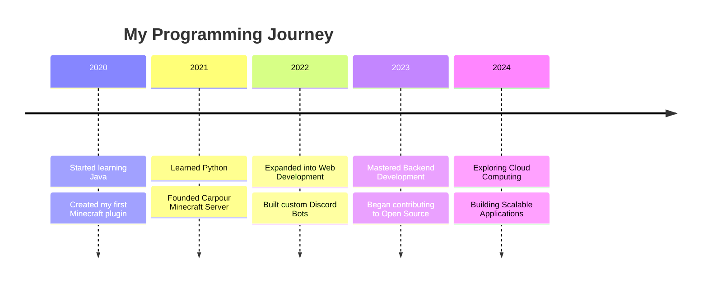

<div align="center">

<!-- Animated Header -->


<!-- Animated Typing Effect -->


</div>

<!-- Enhanced Status Badges -->
<p align="center">
  
  
</p>

<p align="center">
    
</p>

<div align="center">

### 🎯 **Weekly Development Breakdown**

<!--START_SECTION:waka-->
```text
Java         16 hrs 40 mins  ███████████░░░░░░░░  45.2%
Python       12 hrs 20 mins  ██████████░░░░░░░░░  33.5%
JavaScript   4 hrs 30 mins   ████░░░░░░░░░░░░░░░  12.2%
SQL          2 hrs 15 mins   ███░░░░░░░░░░░░░░░░   6.1%
Other        1 hr 5 mins     ██░░░░░░░░░░░░░░░░░   3.0%
```
<!--END_SECTION:waka-->

</div>

<div align="center">

### 🌟 **About Me**


- 👨‍💻 **Founder** of [Carpour](https://carpour.com), a Moroccan Minecraft Server 🌍.
- 🌱 Currently mastering **Django**, **Backend Development**, and **Cloud Technologies**.
- 🎯 **2024 Goals**: Contribute to Open Source and create scalable applications.
- 🎮 Gamer at heart, creator by passion!
- 🌐 Visit my portfolio: [Prism3.me](https://prism3.me).
- ⚡ **Fun Fact**: Code runs through my veins, and games keep my heart alive.

</div>

---

<div align="center">

### 🛠️ **Skills & Technologies Arsenal**

<div align="center">
  
</div>

</div>

<!-- Animated Progress Bars -->
<div align="center">

```javascript
Java        ███████████████████░░░░   85%
Python      ████████████████░░░░░░░   75%
JavaScript  ██████████░░░░░░░░░░░░░   50%
SQL         ███████████████░░░░░░░░   70%
Docker      ████████████░░░░░░░░░░░   60%
Cloud       ███████████████░░░░░░░░   70%
DevOps      ██████████████░░░░░░░░░   65%
```

</div>

---

<div align="center">

### 📊 **GitHub Stats**

<!-- GitHub Stats -->
<p align="center">


</p>


</div>

---

<div align="center">

### 🏆 **Achievements & Contributions**

[](https://github.com/ExceptedPrism3)

</div>

---

<div align="center">

### 🚀 **My Coding Journey**



</div>

---

### 🏆 Notable Projects

<div align="center">

<a href="https://github.com/ExceptedPrism3/Logger">
  
</a>

<a href="https://github.com/ExceptedPrism3/HitRadio">
  
</a>

</div>

---

<div align="center">

### 🤝 **Let's Connect!**

<a href="https://linkedin.com/in/prism3" target="_blank">
  
</a>
<a href="mailto:exceptedprism3@gmail.com" target="_blank">
  
</a>
<a href="https://discord.com/users/403667971089760257" target="_blank">
  
</a>

</div>

---

<div align="center">

### 💖 **Support My Work**

<a href="https://www.buymeacoffee.com/YourUsername">
  
</a>
<a href="https://ko-fi.com/YourUsername">
  
</a>

</div>

---

<div align="center">


</div>
