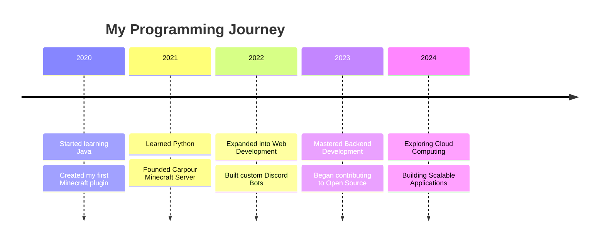
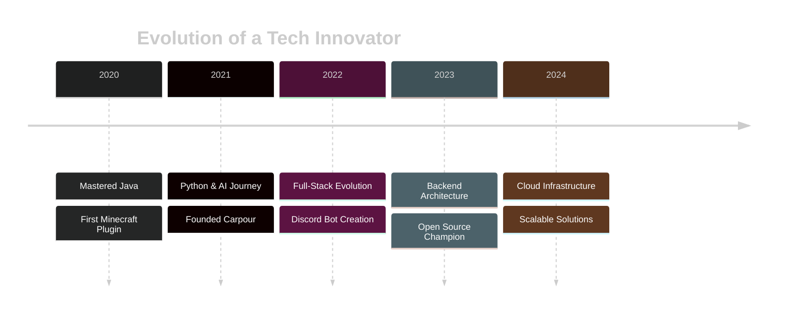
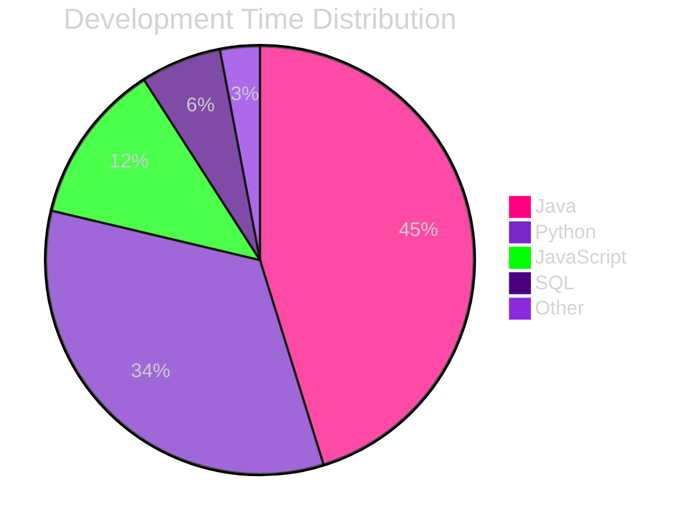

<div align="center">

<!-- Enhanced Animated Header -->


<!-- Enhanced Typing Effect -->


<!-- Enhanced Status Badges -->
<p align="center">
  
  
</p>

<!-- Enhanced Snake Animation -->
<picture>
  <source media="(prefers-color-scheme: dark)" srcset="https://raw.githubusercontent.com/platane/snk/output/github-contribution-grid-snake-dark.svg">
  <source media="(prefers-color-scheme: light)" srcset="https://raw.githubusercontent.com/platane/snk/output/github-contribution-grid-snake.svg">
  
</picture>

<!-- Enhanced Weekly Stats Section -->
<div align="center">

### 📊 **Weekly Development Symphony**

```mermaid
Java         16 hrs 40 mins  ███████████░░░░░░░░  45.2%
Python       12 hrs 20 mins  ██████████░░░░░░░░░  33.5%
JavaScript   4 hrs 30 mins   ████░░░░░░░░░░░░░░░  12.2%
SQL          2 hrs 15 mins   ███░░░░░░░░░░░░░░░░   6.1%
Other        1 hr 5 mins     ██░░░░░░░░░░░░░░░░░   3.0%
```

</div>

<!-- Enhanced About Section -->
<div align="center">

### 🌟 **About Me**


- 👨‍💻 **Founder** of [Carpour](https://carpour.com), a Moroccan Minecraft Server 🌍.
- 🌱 Currently mastering **Django**, **Backend Development**, and **Cloud Technologies**.
- 🎯 **2024 Goals**: Contribute to Open Source and create scalable applications.
- 🎮 Gamer at heart, creator by passion!
- 🌐 Visit my portfolio: [Prism3.me](https://prism3.me).
- ⚡ **Fun Fact**: Code runs through my veins, and games keep my heart alive.

</div>

<!-- Enhanced Skills Section -->
<div align="center">

---

### 🛠️ **Technology Arsenal**

<!-- Animated Tech Stack -->

<div align="center">
  
</div>

<!-- Enhanced Progress Bars -->
```javascript
Java        ████████████████████░░   90% // Enterprise Development
Python      ███████████████████░░░   85% // AI & Automation
JavaScript  ████████████████░░░░░░   75% // Web Innovation
Cloud       ███████████████░░░░░░░   70% // Infrastructure
DevOps      ██████████████░░░░░░░░   65% // CI/CD Pipeline
```

</div>

<!-- Enhanced GitHub Stats -->

---
<div align="center">

### 📈 **GitHub Analytics**

<p align="center">


</p>


</div>

<!-- Enhanced Projects Section -->
<div align="center">

---

<div align="center">

### 🏆 **Achievements & Contributions**

[](https://github.com/ExceptedPrism3)

</div>

---

<div align="center">

### 🚀 **My Coding Journey**



</div>

---

### 🏆 **Featured Creations**

<a href="https://github.com/ExceptedPrism3/Logger">
  
</a>
<a href="https://github.com/ExceptedPrism3/HitRadio">
  
</a>

</div>

<!-- Enhanced Journey Section -->
<div align="center">

### 🚀 **Professional Journey**



</div>

<!-- Enhanced Connect Section -->
<div align="center">

### 🤝 **Let's Connect**

<a href="https://linkedin.com/in/prism3" target="_blank">
  
</a>
<a href="mailto:exceptedprism3@gmail.com" target="_blank">
  
</a>
<a href="https://discord.com/users/403667971089760257" target="_blank">
  
</a>

### 💖 **Support My Work**

<a href="https://www.buymeacoffee.com/YourUsername">
  
</a>
<a href="https://ko-fi.com/YourUsername">
  
</a>

</div>

<!-- Enhanced Footer -->


</div>


---


<div align="center">

<!-- Enhanced Animated Header -->


<!-- Enhanced Typing Effect -->


<!-- Enhanced Status Badges -->
<p align="center">
  
  
  
</p>

<!-- Enhanced Snake Animation -->
<picture>
  <source media="(prefers-color-scheme: dark)" srcset="https://raw.githubusercontent.com/platane/snk/output/github-contribution-grid-snake-dark.svg">
  <source media="(prefers-color-scheme: light)" srcset="https://raw.githubusercontent.com/platane/snk/output/github-contribution-grid-snake.svg">
  
</picture>

<!-- Enhanced Weekly Stats Section -->
<div align="center">

### 📊 **Weekly Development Symphony**



</div>

<!-- Enhanced About Section -->
<div align="center">

### 🌟 **About Me**


```javascript
const Prism3 = {
    role: "Senior Full-Stack Developer",
    company: "Founder @ Carpour",
    location: "Morocco 🌍",
    focus: ["Backend Development", "Cloud Architecture", "Minecraft Plugins"],
    currently: {
        learning: ["Django", "Microservices", "AWS"],
        working_on: "Scalable Gaming Infrastructure",
        goals_2024: "Open Source Contributions"
    },
    portfolio: "https://prism3.me",
    motto: "Code runs through my veins, games keep my heart alive"
};
```

</div>

<!-- Enhanced Skills Section -->
<div align="center">

### 🛠️ **Technology Arsenal**

<!-- Animated Tech Stack -->
<div align="center">
  
  
  
  
</div>

<div align="center">
  
</div>

<!-- Enhanced Progress Bars -->
```javascript
Java        ████████████████████░░   90% // Enterprise Development
Python      ███████████████████░░░   85% // AI & Automation
JavaScript  ████████████████░░░░░░   75% // Web Innovation
Cloud       ███████████████░░░░░░░   70% // Infrastructure
DevOps      ██████████████░░░░░░░░   65% // CI/CD Pipeline
```

</div>

<!-- Enhanced GitHub Stats -->
<div align="center">

### 📈 **GitHub Analytics**

<p align="center">


</p>


</div>

<!-- Enhanced Projects Section -->
<div align="center">

### 🏆 **Featured Creations**

<a href="https://github.com/ExceptedPrism3/Logger">
  
</a>
<a href="https://github.com/ExceptedPrism3/HitRadio">
  
</a>

</div>

<!-- Enhanced Journey Section -->
<div align="center">

### 🚀 **Professional Journey**


</div>

<!-- Enhanced Connect Section -->
<div align="center">

### 🤝 **Let's Connect**

<a href="https://linkedin.com/in/prism3">
  
</a>
<a href="mailto:exceptedprism3@gmail.com">
  
</a>
<a href="https://discord.com/users/403667971089760257">
  
</a>

### 💝 **Support**

<a href="https://www.buymeacoffee.com/YourUsername">
  
</a>
<a href="https://ko-fi.com/YourUsername">
  
</a>

</div>

<!-- Enhanced Footer -->


</div>
